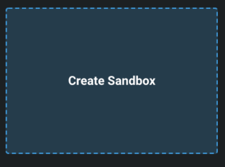
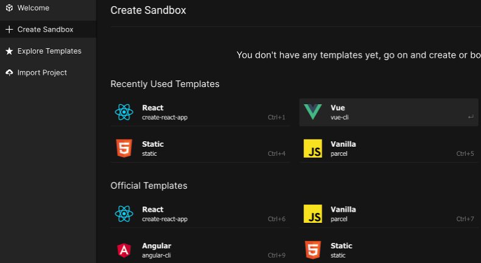
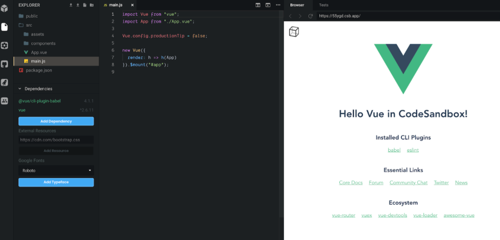
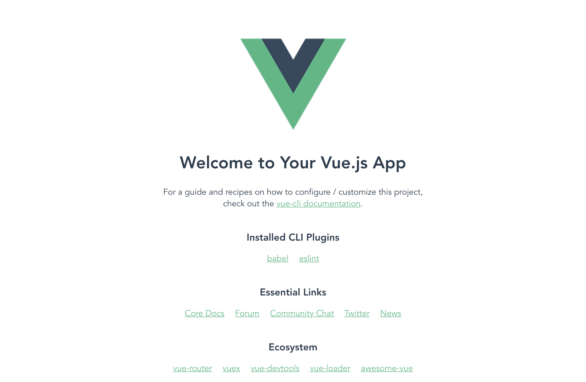

# Step 1: Setting up the Vue App with CodeSandbox

Create a new sandbox Vue project by going to CodeSandbox and clicking on the “Create Sandbox” box.
The options for which kind of sandbox you want to have will appear.



There, choose Vue as the basis for your sandbox. The instant IDE will then set up a base Vue project for you.



Once the IDE finished the setup, it opens your project in the editor.

On the left side, you'll see all generated files in the navigation bar and dependencies the project has so far.
Don’t worry about the dependencies, we are going to explain them later on.

On the right side to the navigation bar, you'll find the editor. Here you can code and see all your changes instantly in the preview to the right.

If you see the project boilerplate, it'll have content so far. It contains a lot of references provided by Vue.js itself to get help.




The `main.js` is the entrypoint for the application start.

```javascript
new Vue({
  render: h => h(App)
}).$mount("#app");
````

Here you can see that a Vue project is initialized and a Vue instance is generated by invoking the Vue constructor, `new Vue({/* options go here */})` and with `$mount([elementOrSelector])` the Vue instance is mounted to the `#app` element.

Every Vue application, no matter how big or small, starts with the root Vue instance.

For more information check out:
- https://codingexplained.com/coding/front-end/vue-js/mounting-templates-dynamically
- https://vuejs.org/v2/guide/instance.html

In the first lines of the `main.js` you can find some imports.
The first one imports the Vue module and the second one is the very first component we will use - it is the App component.

```javascript
import Vue from "vue";
import App from "./App.vue";
```

The App.vue actually contains the ID-Selector `#app` which we'll use to mount the Vue application.

```javascript
<template>
  <div id="app">
    
    <HelloWorld msg="Hello Vue in CodeSandbox!" />
  </div>
</template>
```

---

## Achievement

At the end of step 1, your application should look similar to the following:



---

[Next: Step #2 - Create the first own Vue component "Quiz.vue"](step2.md)
