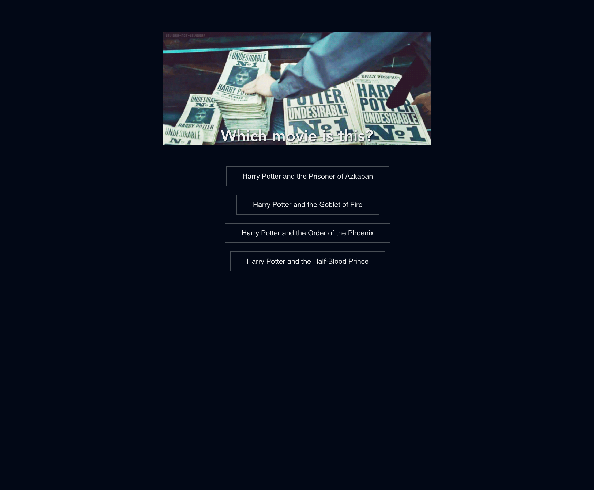

# Step 4: Displaying possible movie options to user

So far we have displayed the list with answers, including all the movies that exist.
But what we want is to provide some suggestions to the user and let them guess which one of these answers is the correct one.

To achieve this, we'll use some buttons. Once one of them is clicked, it turns green if the answer is correct or red if the answer is incorrect.

_Here in step 4, we are changing from presenting all available movies to only a list of 4, where the user can make her choice, by clicking on it.
When in step 5, we will include the evaluation when the user clicks on a button if the answer was correct or wrong._

We also need to change the data used to iterate and employ the data of the current question. We're going to use again a computed property, which returns the possible answers from the current question.

```html
<!--Quiz.vue -->
<ul class="quiz-choices" v-if="stage==='quiz'">
      <li v-for="answerNumber in answers" :key="answerNumber">
            <button class="quiz-button">{{ movies[answerNumber] }}</button>
      </li>
</ul>
```

```javascript
// Quiz.vue
answers() {
      return this.currentQuestionNumber
            ? this.questions[this.currentQuestionNumber - 1].answers
            : [];

      /*
        Learn about ternary operators here:
        - https://developer.mozilla.org/en-US/docs/Web/JavaScript/Reference/Operators/Conditional_Operator
      */
}
```

---

## Achievement

At the end of step 4, after starting the Quiz, your screen should contain the first question and the options to choose:

**After clicking on the start button:**



---

[Prev: Step #3 - Using the Quiz data](step3.md)

[Next: Step #5 - Evaluate the option which was clicked](step5.md)
