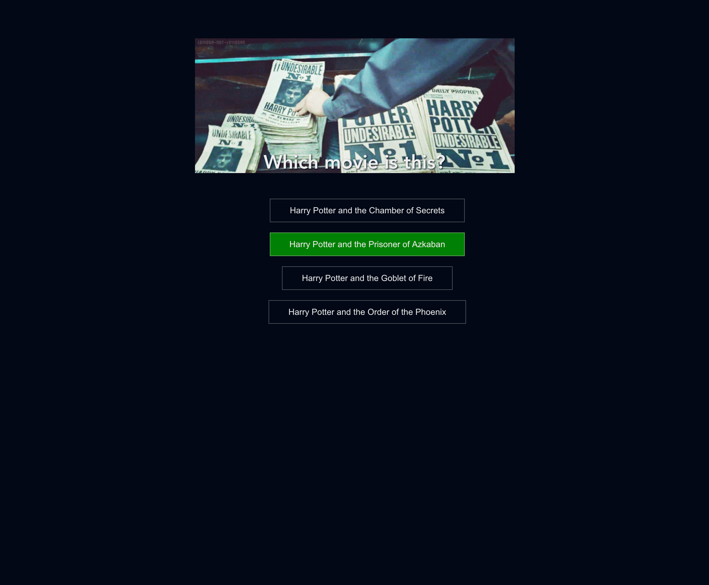
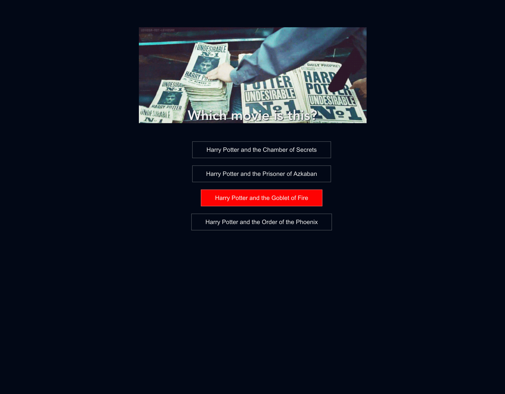

# Step 5: Evaluate the option which was clicked

Now that we offered the user all possible quiz answers, we need to add a click event listener to the options buttons and evaluate if the correct choice was made by the user.

Define two more methods to evaluate the choice and handle the answer.

```html
<!-- Quiz.vue --->
<button
  @click="handleAnswer(answerNumber)"
  class="quiz-button"
  :class="{
    'correct': isCorrectAnswer(answerNumber) && currentUserAnswer === answerNumber,
    'wrong': !isCorrectAnswer(answerNumber) && currentUserAnswer === answerNumber
  }">
  {{ movies[answerNumber - 1] }}
</button>
```

```javascript
// Quiz.vue
data() {
  return {
    // ...
    currentUserAnswer: null
}
// ...
methods: {
// ...
  isCorrectAnswer(answerNumber) {
    return (
      this.currentUserAnswer &&
      answerNumber === this.questions[this.currentQuestionNumber - 1].correct
    );
  },
  handleAnswer(answerNumber) {
    this.currentUserAnswer = answerNumber;
  }
// ...
}
```

Don't forget to enhance the button style for the incorrect and correct answer. Otherwise you won't see any changes in the browser.

```css
.quiz-button.wrong {
  background-color: red;
}
.quiz-button.correct {
  background-color: green;
}
```

---

## Achievement

At the end of step 5, you can click on the button. It when turns its background colour into green or red whether your answer was correct or not.

**Correct answer:**



**Wrong answer:**



---

[Prev: #4 - Displaying possible movie options to user](step4.md)

[Next: Step #6 - Proceed with next question](step6.md)

